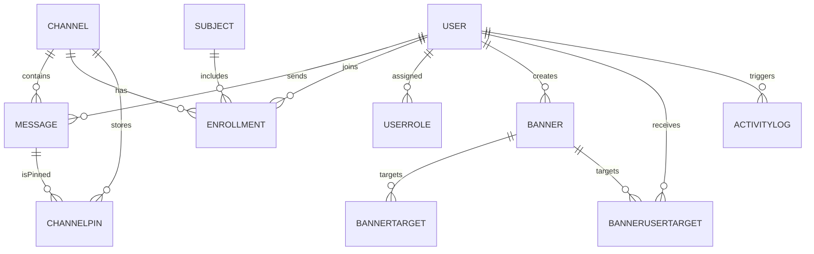
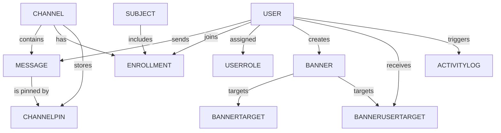
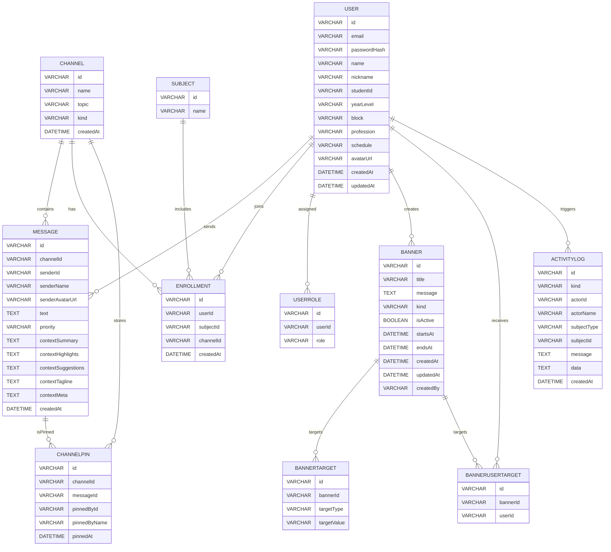
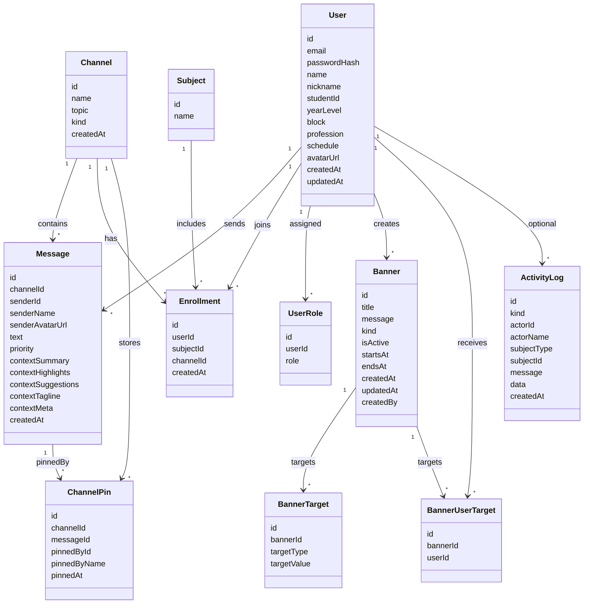

# Conceptual Entity Relationships

This document mirrors the entities defined in `server/prisma/schema.prisma` but removes explicit data types so you can present a conceptual view of the database design.

## Entities

### User

| Field | Notes |
|-------|-------|
| id | `@id @default(cuid())` |
| email | `@unique` |
| passwordHash | |
| name | |
| nickname | |
| studentId | |
| yearLevel | |
| block | |
| profession | |
| schedule | |
| avatarUrl | |
| createdAt | `@default(now())` |
| updatedAt | `@updatedAt` |
| messages | `Message[]` |
| enrollments | `Enrollment[]` |
| roles | `UserRole[]` |
| banners | `Banner[]` |
| bannerUserTargets | `BannerUserTarget[]` |

### Channel

| Field | Notes |
|-------|-------|
| id | `@id @default(cuid())` |
| name | |
| topic | |
| kind | |
| createdAt | `@default(now())` |
| messages | `Message[]` |
| members | `Enrollment[]` |
| pins | `ChannelPin[]` |

### Message

| Field | Notes |
|-------|-------|
| id | `@id @default(cuid())` |
| channelId | |
| senderId | |
| senderName | |
| senderAvatarUrl | |
| text | |
| priority | `@default("normal")` |
| contextSummary | |
| contextHighlights | |
| contextSuggestions | |
| contextTagline | |
| contextMeta | |
| createdAt | `@default(now())` |
| channel | `Channel @relation(fields: [channelId], references: [id])` |
| sender | `User? @relation(fields: [senderId], references: [id])` |
| pins | `ChannelPin[]` |

### ChannelPin

| Field | Notes |
|-------|-------|
| id | `@id @default(cuid())` |
| channelId | |
| messageId | |
| pinnedById | |
| pinnedByName | |
| pinnedAt | `@default(now())` |
| channel | `Channel @relation(fields: [channelId], references: [id])` |
| message | `Message @relation(fields: [messageId], references: [id])` |
| (index) | `@@unique([channelId, messageId])` |

### Subject

| Field | Notes |
|-------|-------|
| id | `@id` |
| name | |
| users | `Enrollment[]` |

### Enrollment

| Field | Notes |
|-------|-------|
| id | `@id @default(cuid())` |
| userId | |
| subjectId | |
| channelId | |
| createdAt | `@default(now())` |
| user | `User @relation(fields: [userId], references: [id])` |
| subject | `Subject? @relation(fields: [subjectId], references: [id])` |
| channel | `Channel? @relation(fields: [channelId], references: [id])` |

### UserRole

| Field | Notes |
|-------|-------|
| id | `@id @default(cuid())` |
| userId | |
| role | |
| user | `User @relation(fields: [userId], references: [id])` |

### Banner

| Field | Notes |
|-------|-------|
| id | `@id @default(cuid())` |
| title | |
| message | |
| kind | `@default("info")` |
| isActive | `@default(false)` |
| startsAt | |
| endsAt | |
| createdAt | `@default(now())` |
| updatedAt | `@updatedAt` |
| createdBy | |
| creator | `User? @relation(fields: [createdBy], references: [id])` |
| targets | `BannerTarget[]` |
| userTargets | `BannerUserTarget[]` |

### BannerTarget

| Field | Notes |
|-------|-------|
| id | `@id @default(cuid())` |
| bannerId | |
| targetType | |
| targetValue | |
| banner | `Banner @relation(fields: [bannerId], references: [id])` |

### BannerUserTarget

| Field | Notes |
|-------|-------|
| id | `@id @default(cuid())` |
| bannerId | |
| userId | |
| banner | `Banner @relation(fields: [bannerId], references: [id])` |
| user | `User @relation(fields: [userId], references: [id])` |

### ActivityLog

| Field | Notes |
|-------|-------|
| id | `@id @default(cuid())` |
| kind | |
| actorId | |
| actorName | |
| subjectType | |
| subjectId | |
| message | |
| data | |
| createdAt | `@default(now())` |
| (index) | `@@index([createdAt])` |
| (index) | `@@index([kind, createdAt])` |

## Relationship Diagram (Conceptual View)

> Copy the `erDiagram` snippet into [https://mermaid.live](https://mermaid.live) or any Mermaid-enabled editor to export PNG/SVG.

## Relationship Diagram Without Attribute Types

Mermaid's `erDiagram` syntax expects a type token before each attribute name. For a relationship-only view, use a simple graph representation:

> Use the `graph TD` snippet in [https://mermaid.live](https://mermaid.live) or any Mermaid-enabled editor to render and export a diagram without attribute listings.

## Relationship Diagram with Entity Boxes (Hidden Types)

If you prefer the table-style ERD boxes but do not want to display data types, hide the type column with a Mermaid init directive:

> Paste this snippet into [https://mermaid.live](https://mermaid.live) to render table-style boxes with the type column hidden.

## Relationship Diagram with Attribute-Only Boxes (Class Diagram)

Mermaid's `classDiagram` lets you list attributes without type tokens while still using boxes. Relationships are added at the end.

> Paste the `classDiagram` block into [https://mermaid.live](https://mermaid.live) to render attribute-only entity boxes.
